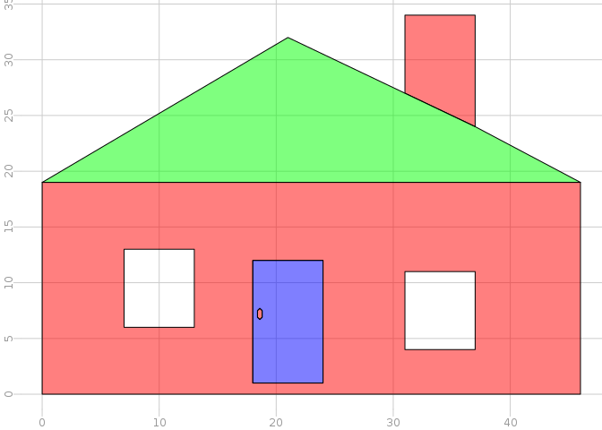

<!-- README.md is generated from README.Rmd. Please edit that file -->
ggrasp
======

gg and R and sp

This is the "vector" version of tabularaster.

Write analogy to gggeom to have doubly nested tables.

``` r
library(ggrasp)
library(tibble)
library(tidyr)

data(holy_poly)
spdata <- spbabel::sp(holy_poly, attr_tab = tibble(mydat = c("a", "b", "c")))
ggg <- nest(spdata)
plot(ggg, col = rainbow(nrow(ggg), alpha = 0.5))
```



Use this basis to build data+pslg version atts, 1D primitives, vertices (unique).

Decompose to just edges.

``` r
#edges <- primitives1D()
```

Use that to build 2D primitives.

Round trip from sp to branches to primitives to sp. Leverage sp/rgeos/rgdal for spatial ops, ggvis for visualization.
